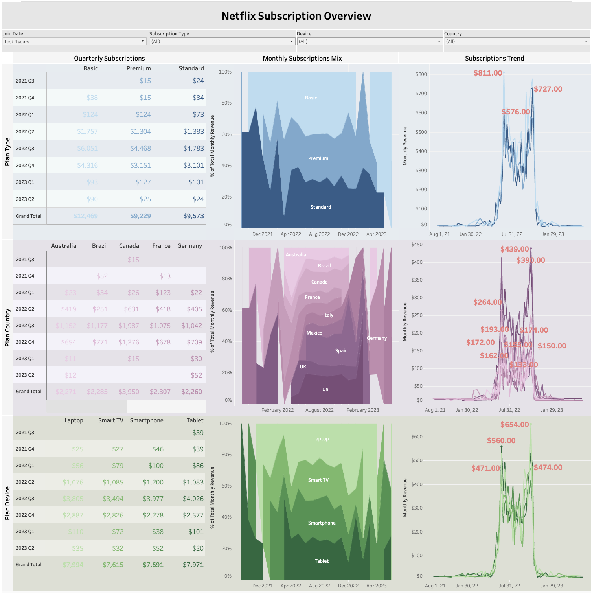

# Netflix Subscription Analysis (2021 - 2023)
Analyzing Netflix subscription trends from 2021 - 2023. Interactive Tableau dashboard can be found [here](https://public.tableau.com/app/profile/johanna.schmidle/viz/NetflixSubscriptionsDash/Dashboard1?publish=yes).
  

    

## Motivation

## Task List
- Clean data in SQL
- Create an interactive dashboard

## Metrics and Dimensions
- **Total Subscriptions:** total subscription sales from all plan types
- **Plan Type:** Basic, Premium, and Standard
- **Country:** Australia, Brazil, Canada, France, Germany, Italy, Mexico, Spain, UK, and US
- **Plan Device:** Device on which the subscription will be used. Laptop, Smart TV, Smartphone, and Tablet

## Summary of Insights
#### Total Subscriptions:
- txt
#### Plan Type:
- txt
#### Plan Period:
- txt
#### Country:
- txt
  
## Data
The dataset used in this project is available publicly on Kaggle: [https://www.kaggle.com/datasets/arnavsmayan/netflix-userbase-dataset](https://www.kaggle.com/datasets/arnavsmayan/netflix-userbase-dataset)

## Technologies
- SQL
- Tableau
