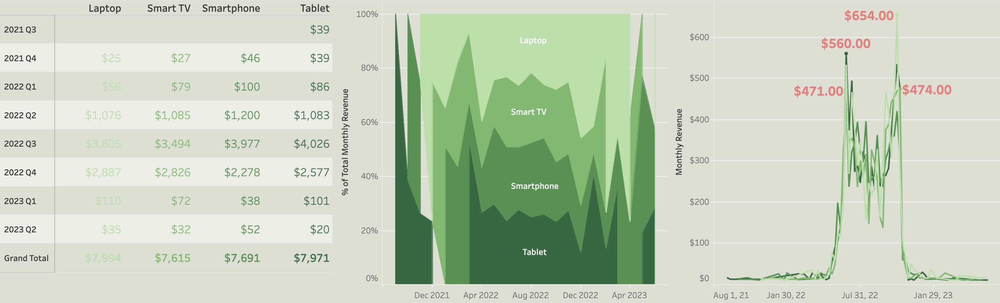

# Netflix Subscription Analysis (2021 - 2023)
## Project Background

Netflix, founded in 1997, is a global streaming platform offering a wide range of TV shows, movies, and original productions to audiences worldwide.

The company has extensive data on user preferences, viewing habits, and subscription trends that has yet to be fully leveraged. This project analyzes Netflix subscription trends to provide valuable insights into market behavior, helping to predict future industry patterns and consumer preferences.

### Insights and Recommendations Are Provided in the Following Key Areas:
- **Plan Type:** Basic, Premium, and Standard.
- **Country:** Australia, Brazil, Canada, France, Germany, Italy, Mexico, Spain, UK, and US.
- **Plan Device:** Device on which the subscription will be used — Laptop, Smart TV, Smartphone, and Tablet.

An interactive Tableau dashboard can be found [here](https://public.tableau.com/app/profile/johanna.schmidle/viz/NetflixSubscriptionsDash/Dashboard1?publish=yes).

The SQL queries used to clean, organize, and prepare data for analysis can be found [here](https://github.com/johannaschmidle/Netflix-Subscription-Analysis/blob/main/NetflixSubsCleaning.sql).

## Data Structure
The dataset provides a snapshot of a sample Netflix userbase, showcasing various aspects of user subscriptions, revenue, account details, and activity.

    

The dataset used in this project is available publicly on Kaggle: [https://www.kaggle.com/datasets/arnavsmayan/netflix-userbase-dataset](https://www.kaggle.com/datasets/arnavsmayan/netflix-userbase-dataset)

## Summary of Insights
#### Plan Type:
- Basic plans are the most popular plan.
- Near the end of June 2022 all plan types saw a significant spike and the basic plan type hit a high of $811.00. These spikes significantly decreased until the end of October 2022 when all plan types spiked again, and Premium and Standard plan types hit highs of $576.00 and $727.00 respectively.
- All plan types seemed to drop off after this second spike completely.

    

#### Plan Country:
- Spain and the US are the top two countries with subscription totals of $5,664 and $5,662 respectively.
- Most countries followed the same spike and decrease pattern as the plan types (spikes in June 2022 and late October 2022) except France which hit its high in August 2022, and Germany which hit its high at the beginning of October 2022.

    

#### Plan Device:
- All four devices are evenly popular for Netflix Subscriptions, each getting a total of around $7,700.
- The devices followed the same spike and decrease pattern as the other two graphs (spikes in June 2022 and late October 2022) with Smartphones and Tablets peaking in June, and Smart TVs and Laptops peaking in October.

    

## Recommended Next Steps For Company
#### Budget Recommendations
- **Allocate more budget for localized content and promotions** in Spain and the US, given their strong subscription performance.
- **Increase the budget for marketing efforts and promotions** during the months of June to October, as these months had a significant dip in subscriptions.
#### Device-Related Recommendations
- **Ensure the quality of the Netflix app is optimized** across all devices, particularly Smartphones and Tablets, since they appear to lead subscriptions during the June peak.
- **Experiment with bundling strategies**, such as offering discounts for multi-device users.
#### Other Recommendations
- **Analyze competitors' activities during June and October** to identify any overlaps with Netflix’s trends and adjust strategies accordingly.

## Technologies
- SQL
- Tableau
